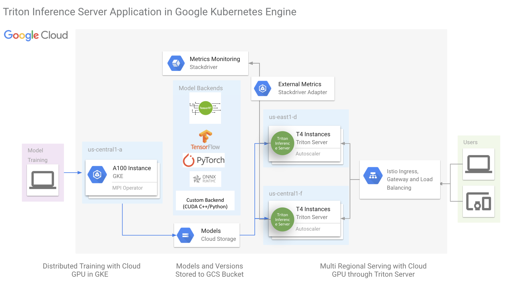
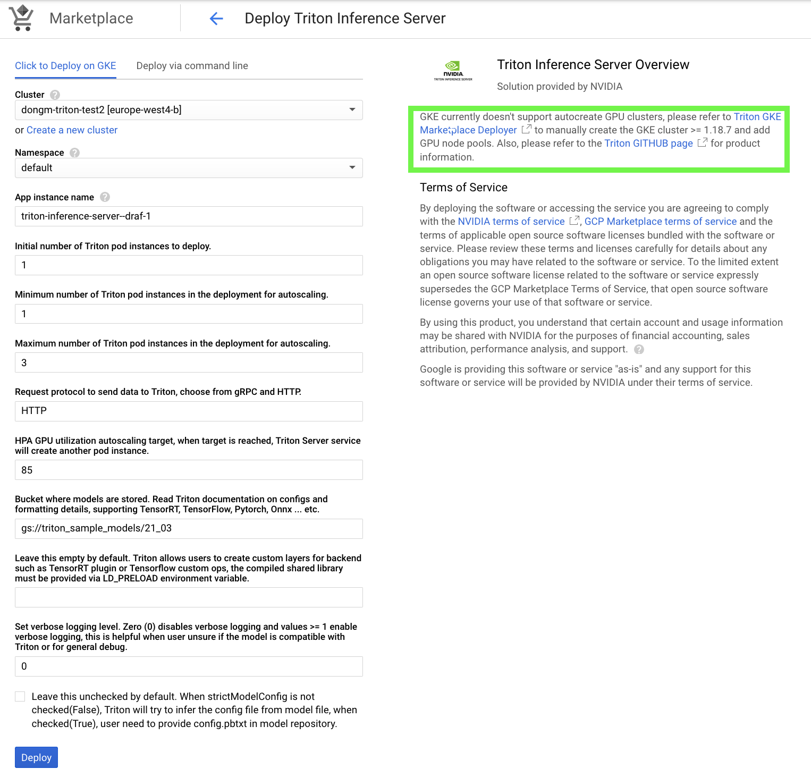

<!--
# Copyright (c) 2021-2024, NVIDIA CORPORATION & AFFILIATES. All rights reserved.
#
# Redistribution and use in source and binary forms, with or without
# modification, are permitted provided that the following conditions
# are met:
#  * Redistributions of source code must retain the above copyright
#    notice, this list of conditions and the following disclaimer.
#  * Redistributions in binary form must reproduce the above copyright
#    notice, this list of conditions and the following disclaimer in the
#    documentation and/or other materials provided with the distribution.
#  * Neither the name of NVIDIA CORPORATION nor the names of its
#    contributors may be used to endorse or promote products derived
#    from this software without specific prior written permission.
#
# THIS SOFTWARE IS PROVIDED BY THE COPYRIGHT HOLDERS ``AS IS'' AND ANY
# EXPRESS OR IMPLIED WARRANTIES, INCLUDING, BUT NOT LIMITED TO, THE
# IMPLIED WARRANTIES OF MERCHANTABILITY AND FITNESS FOR A PARTICULAR
# PURPOSE ARE DISCLAIMED.  IN NO EVENT SHALL THE COPYRIGHT OWNER OR
# CONTRIBUTORS BE LIABLE FOR ANY DIRECT, INDIRECT, INCIDENTAL, SPECIAL,
# EXEMPLARY, OR CONSEQUENTIAL DAMAGES (INCLUDING, BUT NOT LIMITED TO,
# PROCUREMENT OF SUBSTITUTE GOODS OR SERVICES; LOSS OF USE, DATA, OR
# PROFITS; OR BUSINESS INTERRUPTION) HOWEVER CAUSED AND ON ANY THEORY
# OF LIABILITY, WHETHER IN CONTRACT, STRICT LIABILITY, OR TORT
# (INCLUDING NEGLIGENCE OR OTHERWISE) ARISING IN ANY WAY OUT OF THE USE
# OF THIS SOFTWARE, EVEN IF ADVISED OF THE POSSIBILITY OF SUCH DAMAGE.
-->

# NVIDIA Triton 推理服务器 GKE 市场应用

**目录**
- [NVIDIA Triton 推理服务器 GKE 市场应用](#nvidia-triton-推理服务器-gke-市场应用)
  - [描述](#描述)
  - [前提条件](#前提条件)
  - [演示说明](#演示说明)
  - [其他资源](#其他资源)
  - [已知问题](#已知问题)

## 描述

本仓库包含 NVIDIA Triton 推理服务器部署器的 Google Kubernetes Engine(GKE) 市场应用。

 - Triton GKE 部署器是 GKE 市场推荐的 helm chart 部署器
 - Triton GKE 部署器部署一个 GKE ingress，用于接受公共推理请求
 - Triton GKE 部署器包含一个水平 Pod 自动缩放器(HPA)，它依赖于 [stack driver 自定义指标适配器](https://github.com/GoogleCloudPlatform/k8s-stackdriver/tree/master/custom-metrics-stackdriver-adapter) 来监控 GPU 占用率，并自动缩放 GPU 节点
 - 本仓库还包含一个示例，用于使用 TensorRT 生成 BERT 模型，并使用 Locust 来实验 GPU 节点自动缩放和监控客户端延迟/吞吐量



## 前提条件

 - [在您的笔记本电脑/客户端工作站上安装 Google Cloud SDK](https://cloud.google.com/sdk/docs/install)，以便可以在客户端上运行 `gcloud` SDK 命令行界面并使用您的 GCP 凭证登录
 - 此外，用户可以利用 [Google Cloud shell](https://cloud.google.com/shell/docs/launching-cloud-shell)

## 演示说明

首先，将此 Triton GKE 应用安装到具有 GPU 节点池的现有 GKE 集群中，Google Cloud Marketplace 目前不支持自动创建 GPU 集群。用户必须运行以下命令来创建具有 GPU 节点池的兼容集群（gke 版本 >=1.18.7），我们建议用户选择 T4 或 A100(MIG) 实例类型，并根据实际推理工作流的分析选择 CPU 比率。

用户需要按照这些[说明](https://cloud.google.com/kubernetes-engine/docs/how-to/kubernetes-service-accounts#creating_a_kubernetes_service_account)创建 kubernetes 服务账号。在此示例中，我们使用 `gke-test@k80-exploration.iam.gserviceaccount.com`。确保它有权访问 artifact registry 和监控查看器。例如，要授予对 HPA 工作所需的自定义指标的访问权限：
```
gcloud iam service-accounts add-iam-policy-binding --role \
  roles/iam.workloadIdentityUser --member \
  "serviceAccount:<project-id>.svc.id.goog[custom-metrics/custom-metrics-stackdriver-adapter]" \
  <google-service-account>@<project-id>.iam.gserviceaccount.com

kubectl annotate serviceaccount --namespace custom-metrics \
  custom-metrics-stackdriver-adapter \
  iam.gke.io/gcp-service-account=<google-service-account>@<project-id>.iam.gserviceaccount.com
```

目前，GKE >= 1.18.7 仅在 GKE rapid 通道中支持，要查找最新版本，请访问 [GKE 发布说明](https://cloud.google.com/kubernetes-engine/docs/release-notes)。
```
export PROJECT_ID=<您的 GCP 项目 ID>
export ZONE=<您选择的 GCP 区域>
export REGION=<您选择的 GCP 地区>
export DEPLOYMENT_NAME=<GKE 集群名称，例如 triton-gke>
# 示例：export SERVICE_ACCOUNT="gke-test@k80-exploration.iam.gserviceaccount.com"
export SERVICE_ACCOUNT=<您的 GKE 服务账号>

gcloud beta container clusters create ${DEPLOYMENT_NAME} \
--addons=HorizontalPodAutoscaling,HttpLoadBalancing \
--service-account=${SERVICE_ACCOUNT} \
--machine-type=n1-standard-8 \
--node-locations=${ZONE} \
--monitoring=SYSTEM \
--zone=${ZONE} \
--subnetwork=default \
--scopes cloud-platform \
--num-nodes 1 \
--project ${PROJECT_ID}

# 添加 GPU 节点池，用户可以根据工作负载修改节点数量
gcloud container node-pools create accel \
  --project ${PROJECT_ID} \
  --zone ${ZONE} \
  --cluster ${DEPLOYMENT_NAME} \
  --service-account=${SERVICE_ACCOUNT} \
  --num-nodes 2 \
  --accelerator type=nvidia-tesla-t4,count=1 \
  --enable-autoscaling --min-nodes 2 --max-nodes 3 \
  --machine-type n1-standard-4 \
  --disk-size=100 \
  --scopes cloud-platform \
  --verbosity error

# 这样您就可以在本地运行 kubectl 来访问集群
gcloud container clusters get-credentials ${DEPLOYMENT_NAME} --project ${PROJECT_ID} --zone ${ZONE}

# 部署 NVIDIA device plugin for GKE 以准备 GPU 节点的驱动程序安装
kubectl apply -f https://raw.githubusercontent.com/GoogleCloudPlatform/container-engine-accelerators/master/nvidia-driver-installer/cos/daemonset-preloaded-latest.yaml

# 确保您可以在本地运行 kubectl 来访问集群
kubectl create clusterrolebinding cluster-admin-binding --clusterrole cluster-admin --user "$(gcloud config get-value account)"

# 启用 stackdriver 自定义指标适配器
kubectl apply -f https://raw.githubusercontent.com/GoogleCloudPlatform/k8s-stackdriver/master/custom-metrics-stackdriver-adapter/deploy/production/adapter_new_resource_model.yaml

# 为 ingress 流量创建一个 IP
gcloud compute addresses create ingress-triton --global
```

创建集群和添加 GPU 节点可能需要长达 10 分钟。执行此命令后请耐心等待。GCP 中的 GPU 资源可能被完全利用，因此如果无法分配计算资源，请尝试不同的区域。GKE 集群运行后，运行 `kubectl get pods --all-namespaces` 以确保客户端可以正确访问集群。

如果用户想要在 GKE 中试验 A100 MIG 分区 GPU，请使用以下命令创建节点池：
```
gcloud beta container node-pools create accel \
  --project ${PROJECT_ID} \
  --zone ${ZONE} \
  --cluster ${DEPLOYMENT_NAME} \
  --service-account=${SERVICE_ACCOUNT} \
  --num-nodes 1 \
  --accelerator type=nvidia-tesla-a100,count=1,gpu-partition-size=1g.5gb  \
  --enable-autoscaling --min-nodes 1 --max-nodes 2 \
  --machine-type=a2-highgpu-1g  \
  --disk-size=100 \
  --scopes cloud-platform \
  --verbosity error
```

请注意，GKE 中的 A100 MIG 目前不支持 GPU 指标，而且 Triton GPU 指标与 A100 MIG 不兼容。因此，在部署 Triton GKE 应用时，请通过取消选择 allowGPUMetrics 来禁用 GPU 指标。同样由于这个原因，此部署器也不支持在 A100 MIG 上进行推理工作负载自动缩放。

其次，转到此 [GKE Marketplace 链接](https://console.cloud.google.com/marketplace/details/nvidia-ngc-public/triton-inference-server)来部署 Triton 应用程序。

如果用户的模型已经通过 Triton 测试/验证，他们可以保留所有默认设置。他们可以提供指向包含其模型的模型仓库的 GCS 路径。默认情况下，我们在公共演示 GCS 存储桶中提供了一个由 TensorRT 优化的 BERT large 模型，该模型与 Triton Server 的 `xx.yy` 版本兼容，位于 `gs://triton_sample_models/xx_yy`。但是，请注意以下关于此演示存储桶的事项：
- 演示存储桶中提供的 TensorRT 引擎仅与 Tesla T4 GPU 兼容
- 此存储桶位于 `us-central1`，因此从此存储桶加载到其他区域的 Triton 可能会受到影响
- 此 Triton GKE 应用程序的首次部署将比后续运行慢，因为需要将镜像拉取到 GKE 集群中
- 您可以在[此处](trt-engine/README.md)找到如何生成和上传此模型的示例

其中 <xx.yy> 是所需的 NGC Triton 容器版本。



我们想讨论用户可以利用的 HPA 自动缩放指标。GPU 功率（功率百分比）往往是一个可靠的指标，特别是对于较大的 GPU，如 V100 和 A100。GKE 目前原生支持 GPU 占用率，这是 `nvidia-smi` 中的 GPU 利用率。我们要求用户始终分析其模型以确定自动缩放目标和指标。在尝试为自动缩放选择正确的指标时，目标应该基于以下几点：1、满足 SLA 要求。2、考虑瞬时请求负载，3、尽可能保持 GPU 充分利用。分析分为两个方面：如果用户决定使用占用率或其他 GPU 指标，建议建立基线以将 SLA 要求（如延迟）与 GPU 指标联系起来，例如，对于模型 A，当占用率低于 80% 时，99% 的时间延迟将低于 10ms。此外，分析还可以使用 [Nsight](https://developer.nvidia.com/nsight-systems) 等工具为推理提供模型优化的见解。

应用程序成功部署后，从 ingress 获取公共 IP：
```
> kubectl get ingress
NAME              CLASS    HOSTS   ADDRESS          PORTS   AGE
triton-external   <none>   *       35.186.215.182   80      107s
```

第三，我们将尝试使用提供的客户端示