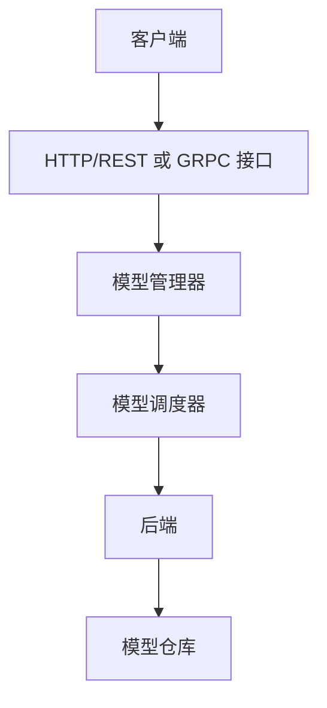
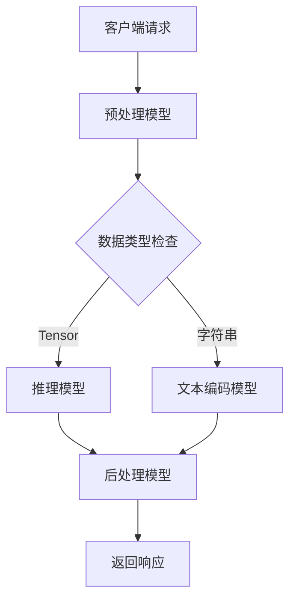

# Triton Inference Server 中文使用指南

## 1. 简介

Triton Inference Server 是一个开源的推理服务器，用于部署机器学习模型。它支持多种深度学习框架，提供高性能的模型服务，并具有灵活的部署选项。Triton 由 NVIDIA 开发，专为生产环境设计，可以处理复杂的推理工作负载。

### 1.1 主要特性

- **多框架支持**：支持 TensorRT、TensorFlow、PyTorch、ONNX Runtime、OpenVINO 等多种框架
- **高性能**：提供动态批处理、并发模型执行、GPU 加速等性能优化功能
- **灵活部署**：支持 Docker 容器、Kubernetes、云环境等多种部署方式
- **可扩展性**：支持自定义后端和前端扩展，满足特定需求
- **监控与管理**：提供完整的指标收集和模型管理 API

## 2. 系统架构

### 2.1 核心组件



- **模型仓库**：基于文件系统的模型存储库，支持本地文件系统、GCS、S3 和 Azure Storage
- **推理协议**：支持 HTTP/REST、GRPC 和 C API，提供标准化的推理请求和响应格式
- **调度系统**：支持多种调度和批处理算法，包括默认调度器、动态批处理和序列批处理
- **后端系统**：支持多种深度学习框架的后端实现，可通过 C API 扩展自定义后端


### 2.2 并行执行

- **多模型并行**：支持多个模型同时执行，充分利用系统资源
- **模型实例**：支持同一模型的多个实例并行执行，提高吞吐量
- **资源调度**：灵活的 GPU 和 CPU 资源调度，优化硬件利用率


## 3. 模型部署流程

### 3.1 模型兼容性检查

在部署模型前，需要确认模型是否属于 Triton 支持的后端类型：

1. **框架后端**
   - ONNXRuntime：支持 ONNX 格式模型
   - TensorFlow：支持 SavedModel 和 GraphDef 格式
   - TensorRT：支持 TensorRT 引擎文件
   - PyTorch：支持 TorchScript 模型
   - OpenVINO：支持 OpenVINO IR 模型

2. **自定义后端**
   - Python Backend：使用 Python 实现自定义模型逻辑
   - C++ Backend：使用 C++ 实现高性能自定义后端

### 3.2 模型配置

每个模型需要一个配置文件 `config.pbtxt`，定义模型的基本信息和运行参数。

1. **基本配置要求**
   ```protobuf
   name: "my_model"                 # 模型名称
   platform: "tensorrt_plan"        # 或使用 backend: "onnxruntime" 等
   max_batch_size: 8                # 最大批处理大小，0表示不支持批处理
   input [                          # 输入张量定义
     {
       name: "input0"
       data_type: TYPE_FP32
       dims: [ 3, 224, 224 ]       # 输入维度
     }
   ]
   output [                         # 输出张量定义
     {
       name: "output0"
       data_type: TYPE_FP32
       dims: [ 1000 ]              # 输出维度
     }
   ]
   ```

2. **自动配置生成**
   - 对于 ONNXRuntime、TensorFlow SavedModel 和 TensorRT 模型，Triton 可以自动生成配置
   - 启动服务器时使用 `--strict-model-config=false` 启用自动配置
   - 使用 `--log-verbose=1` 查看生成的完整配置

3. **高级配置选项**
   - **实例组**：控制模型实例数量和分布
     ```protobuf
     instance_group [
       {
         count: 2                    # 创建2个模型实例
         kind: KIND_GPU
         gpus: [ 0, 1 ]             # 在GPU 0和1上运行
       }
     ]
     ```
   
   - **动态批处理**：合并请求提高吞吐量
     ```protobuf
     dynamic_batching {
       preferred_batch_size: [ 4, 8 ]  # 首选批处理大小
       max_queue_delay_microseconds: 100  # 最大等待时间
     }
     ```

### 3.3 模型仓库结构

模型仓库必须遵循特定的目录结构：

```
<model-repository-path>/
  <model-name>/
    [config.pbtxt]                # 模型配置文件
    [<output-labels-file> ...]    # 可选的标签文件
    <version>/                    # 模型版本目录，如 1/
      <model-definition-file>     # 模型文件
    <version>/                    # 另一个版本，如 2/
      <model-definition-file>
    ...
```

### 3.4 启动服务器

使用以下命令启动 Triton 服务器：

```bash
# 基本启动命令
tritonserver --model-repository=/path/to/models

# 使用多个模型仓库
tritonserver --model-repository=/models1 --model-repository=/models2

# 启用HTTP和GRPC端口
tritonserver --model-repository=/models \
  --http-port=8000 --grpc-port=8001 --metrics-port=8002

# 启用GPU支持
tritonserver --model-repository=/models --gpu-memory-fraction=0.6
```

## 4. 性能优化

### 4.1 性能分析工具

1. **Perf Analyzer**
   - 用于测量模型性能的命令行工具
   - 支持测试不同并发度、批处理大小的性能
   - 提供吞吐量和延迟分析

   ```bash
   # 基本性能测试
   perf_analyzer -m my_model --percentile=95 --concurrency-range 1:4
   
   # 测试不同批处理大小
   perf_analyzer -m my_model --batch-size=4 --concurrency-range 1:4
   ```

2. **Model Analyzer**
   - 自动搜索最优配置参数
   - 分析 GPU 内存使用情况
   - 生成详细的性能报告

   ```bash
   # 基本用法
   model-analyzer profile -m my_model
   
   # 指定配置搜索空间
   model-analyzer profile -m my_model \
     --config-search-max-instance-count=4 \
     --config-search-max-preferred-batch-sizes=8
   ```

### 4.2 优化技巧

1. **动态批处理（Dynamic Batching）**
   - 自动合并单个推理请求为批处理请求
   - 显著提高 GPU 利用率和吞吐量
   - 适用于延迟不敏感的应用场景

   ```protobuf
   dynamic_batching {
     max_queue_delay_microseconds: 1000
     preferred_batch_size: [ 4, 8, 16 ]
   }
   ```

2. **实例组（Instance Group）**
   - 创建多个模型实例并行处理请求
   - 通常 2 个实例可显著提高性能
   - 可以指定在 CPU 或特定 GPU 上运行

   ```protobuf
   instance_group [
     {
       count: 2
       kind: KIND_GPU
     }
   ]
   ```

3. **框架特定优化**
   - **TensorRT**：使用 FP16 或 INT8 量化减少内存使用和提高性能
   - **TensorFlow**：启用 XLA 编译优化计算图
   - **ONNX Runtime**：启用图优化和执行加速器

4. **响应缓存**
   - 缓存常见请求的推理结果
   - 适用于重复请求频繁的场景

   ```protobuf
   response_cache {
     enable: true
   }
   ```

## 5. 最佳实践

### 5.1 部署检查清单

1. **模型验证**
   - 确保模型可以正常加载和推理
   - 验证输入输出配置与实际模型匹配
   - 测试不同输入大小和类型的处理

2. **性能测试**
   - 使用 Perf Analyzer 进行基准测试
   - 测试不同并发度下的性能表现
   - 验证是否满足服务质量要求（QoS）

3. **资源规划**
   - 评估每个模型的 GPU 内存需求
   - 规划多模型部署的资源分配
   - 考虑峰值负载下的系统表现

### 5.2 性能调优步骤


1. **基准测试**
   - 记录初始性能数据作为基线
   - 识别性能瓶颈（CPU、GPU、内存、I/O）
   - 设定性能目标（吞吐量、延迟）

2. **配置优化**
   - 启用动态批处理并调整参数
   - 增加模型实例数量（通常 2-4 个）
   - 使用 Model Analyzer 寻找最优配置

3. **监控与维护**
   - 监控系统资源使用情况
   - 收集性能指标和错误日志
   - 定期进行性能评估和优化

### 5.3 多模型部署策略

1. **模型分组**
   - 将相关模型部署在同一服务器
   - 考虑模型之间的依赖关系

2. **资源隔离**
   - 为关键模型分配专用资源
   - 使用实例组控制 GPU 分配

3. **模型集成**
   - 使用模型集成（Ensemble）组合多个模型
   - 减少客户端与服务器之间的通信开销

## 6. 故障排除

### 6.1 常见问题

1. **模型加载失败**
   - 检查模型文件完整性和格式
   - 验证配置文件中的路径和参数
   - 查看详细日志确定具体错误

2. **性能问题**
   - 检查批处理配置是否合理
   - 验证实例数量和分布是否优化
   - 监控 GPU 利用率和内存使用

3. **内存问题**
   - 减少模型实例数量或批处理大小
   - 考虑使用模型量化减少内存占用
   - 检查是否存在内存泄漏

### 6.2 调试工具

1. **日志级别**
   - 使用 `--log-verbose=1` 启用详细日志
   - 查看模型加载和推理过程的详细信息

2. **性能分析**
   - 使用 Perf Analyzer 定位性能瓶颈
   - 使用 NVIDIA Nsight Systems 分析 GPU 使用

3. **健康检查**
   - 使用 HTTP 端点 `/v2/health/ready` 检查服务就绪状态
   - 使用 `/v2/models/{model_name}/ready` 检查特定模型状态

## 7. 高级功能

### 7.1 模型集成（Ensemble）

模型集成允许将多个模型组合成一个推理管道，自动处理模型间数据传递。



**配置示例（config.pbtxt）：**
```protobuf
// 集成模型配置
name: "pipeline_ensemble"
platform: "ensemble"
max_batch_size: 8  // 最大批处理大小

// 定义模型执行流程
ensemble_scheduling {
  step [
    {
      model_name: "preprocess_model"  // 预处理模型名称
      model_version: -1  // 始终使用最新版本
      input_map {
        key: "raw_input"     // 外部输入字段
        value: "input_data"  // 映射到预处理模型的输入
      }
      output_map {
        key: "processed_data"  // 预处理输出
        value: "preprocess_output"  // 传递给下游模型
      }
    },
    {
      model_name: "inference_model"  // 推理模型名称
      input_map {
        key: "model_input"          // 推理模型输入字段
        value: "preprocess_output"   // 来自预处理模型的输出
      }
      output_map {
        key: "model_output"         // 推理模型输出字段
        value: "inference_result"   // 传递给后处理模型
      }
    }
  ]
}

// 输入输出定义需与各子模型匹配
input [
  {
    name: "input_data"      // 集成模型输入名称
    data_type: TYPE_STRING  // 支持字符串类型输入
    dims: [ -1 ]            // 可变长度输入（适用于文本/语音）
  }
]
output [
  {
    name: "final_result"  // 最终输出名称
    data_type: TYPE_FP32  // 浮点型输出
    dims: [ 1000 ]        // 输出维度（分类任务常用）
  }
]
```

这种方式可以将复杂的推理流程（如"数据预处理 -> 推理 -> 数据后处理