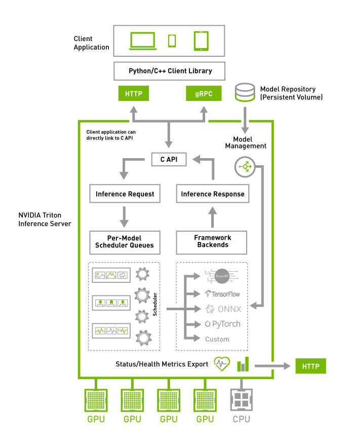

<!--
# Copyright 2018-2023, NVIDIA CORPORATION & AFFILIATES. All rights reserved.
#
# Redistribution and use in source and binary forms, with or without
# modification, are permitted provided that the following conditions
# are met:
#  * Redistributions of source code must retain the above copyright
#    notice, this list of conditions and the following disclaimer.
#  * Redistributions in binary form must reproduce the above copyright
#    notice, this list of conditions and the following disclaimer in the
#    documentation and/or other materials provided with the distribution.
#  * Neither the name of NVIDIA CORPORATION nor the names of its
#    contributors may be used to endorse or promote products derived
#    from this software without specific prior written permission.
#
# THIS SOFTWARE IS PROVIDED BY THE COPYRIGHT HOLDERS ``AS IS'' AND ANY
# EXPRESS OR IMPLIED WARRANTIES, INCLUDING, BUT NOT LIMITED TO, THE
# IMPLIED WARRANTIES OF MERCHANTABILITY AND FITNESS FOR A PARTICULAR
# PURPOSE ARE DISCLAIMED.  IN NO EVENT SHALL THE COPYRIGHT OWNER OR
# CONTRIBUTORS BE LIABLE FOR ANY DIRECT, INDIRECT, INCIDENTAL, SPECIAL,
# EXEMPLARY, OR CONSEQUENTIAL DAMAGES (INCLUDING, BUT NOT LIMITED TO,
# PROCUREMENT OF SUBSTITUTE GOODS OR SERVICES; LOSS OF USE, DATA, OR
# PROFITS; OR BUSINESS INTERRUPTION) HOWEVER CAUSED AND ON ANY THEORY
# OF LIABILITY, WHETHER IN CONTRACT, STRICT LIABILITY, OR TORT
# (INCLUDING NEGLIGENCE OR OTHERWISE) ARISING IN ANY WAY OUT OF THE USE
# OF THIS SOFTWARE, EVEN IF ADVISED OF THE POSSIBILITY OF SUCH DAMAGE.
-->

# Triton 架构

下图展示了 Triton Inference Server 的高层架构。[模型仓库](model_repository.md)是一个基于文件系统的仓库，用于存储 Triton 将提供推理服务的模型。推理请求通过 [HTTP/REST 或 GRPC](../customization_guide/inference_protocols.md) 或 [C API](../customization_guide/inference_protocols.md) 到达服务器，然后被路由到相应的每个模型的调度器。Triton 实现了[多种调度和批处理算法](#models-and-schedulers)，可以在每个模型的基础上进行配置。每个模型的调度器可以选择性地对推理请求进行批处理，然后将请求传递给与模型类型相对应的[后端](https://github.com/triton-inference-server/backend/blob/main/README.md)。后端使用批处理请求中提供的输入执行推理以产生所请求的输出。然后返回这些输出。

Triton 支持[后端 C API](https://github.com/triton-inference-server/backend/blob/main/README.md#triton-backend-api)，允许通过新功能扩展 Triton，例如自定义预处理和后处理操作，甚至是新的深度学习框架。

通过专用的[模型管理 API](model_management.md)，可以查询和控制 Triton 正在服务的模型，该 API 可通过 HTTP/REST 或 GRPC 协议或 C API 使用。

就绪性和活跃性健康端点以及利用率、吞吐量和延迟指标使 Triton 能够轻松集成到 Kubernetes 等部署框架中。



## 并发模型执行

Triton 架构允许多个模型和/或同一模型的多个实例在同一系统上并行执行。系统可以有零个、一个或多个 GPU。下图显示了一个包含两个模型的示例：model0 和 model1。假设 Triton 当前没有处理任何请求，当两个请求同时到达（每个模型一个）时，Triton 立即将它们都调度到 GPU 上，GPU 的硬件调度器开始并行处理这两个计算。在系统 CPU 上执行的模型由 Triton 类似地处理，只是执行每个模型的 CPU 线程的调度由系统的操作系统处理。


默认情况下，如果同一模型的多个请求同时到达，Triton 将通过一次只在 GPU 上调度一个请求来序列化它们的执行，如下图所示。


Triton 提供了一个名为 instance-group 的[模型配置选项](model_configuration.md#instance-groups)，允许每个模型指定应该允许该模型的多少个并行执行。每个启用的并行执行被称为一个*实例*。默认情况下，Triton 为系统中每个可用的 GPU 给每个模型一个实例。通过使用模型配置中的 instance_group 字段，可以更改模型的执行实例数量。下图显示了当 model1 配置为允许三个实例时的模型执行情况。如图所示，前三个 model1 推理请求立即并行执行。第四个 model1 推理请求必须等到前三个执行中的一个完成后才能开始。


## 模型和调度器

Triton 支持多种调度和批处理算法，可以为每个模型独立选择。本节描述了*无状态*、*有状态*和*集成*模型，以及 Triton 如何提供调度器来支持这些模型类型。对于给定的模型，调度器的选择和配置是通过[模型的配置文件](model_configuration.md)完成的。

### 无状态模型

就 Triton 的调度器而言，*无状态*模型在推理请求之间不维护状态。在无状态模型上执行的每个推理都独立于使用该模型的所有其他推理。

无状态模型的例子包括 CNN，如图像分类和对象检测。[默认调度器](model_configuration.md#default-scheduler)或[动态批处理器](model_configuration.md#dynamic-batcher)可以用作这些无状态模型的调度器。

RNN 和类似的具有内部记忆的模型也可以是无状态的，只要它们维护的状态不跨越推理请求。例如，如果内部状态不在推理请求的批次之间传递，那么在批次中迭代所有元素的 RNN 被 Triton 视为无状态的。[默认调度器](model_configuration.md#default-scheduler)可以用于这些无状态模型。[动态批处理器](model_configuration.md#dynamic-batcher)不能使用，因为模型通常不期望批次代表多个推理请求。

### 有状态模型

就 Triton 的调度器而言，*有状态*模型在推理请求之间确实维护状态。该模型期望多个推理请求一起形成一个推理序列，这些请求必须路由到同一个模型实例，以便模型维护的状态得到正确更新。此外，模型可能要求 Triton 提供*控制*信号，例如指示序列的开始和结束。

这些有状态模型必须使用[序列批处理器](model_configuration.md#sequence-batcher)。如下所述，序列批处理器确保序列中的所有推理请求都路由到同一个模型实例，以便模型可以正确维护状态。序列批处理器还与模型通信，以指示序列何时开始、序列何时结束、序列何时有推理请求准备执行，以及序列的*相关 ID*。

在为有状态模型发出推理请求时，客户端应用程序必须为序列中的所有请求提供相同的相关 ID，并且必须标记序列的开始和结束。相关 ID 允许 Triton 识别这些请求属于同一序列。

#### 控制输入

为了使有状态模型能够与序列批处理器正确工作，该模型通常必须接受一个或多个*控制*输入张量，Triton 使用这些张量与模型进行通信。[模型配置](model_configuration.md)的 *ModelSequenceBatching::Control* 部分指示了模型如何暴露序列批处理器应该用于这些控制的张量。所有控制都是可选的。以下是模型配置的一部分，显示了所有可用控制信号的示例配置。

```
sequence_batching {
  control_input [
    {
      name: "START"
      control [
        {
          kind: CONTROL_SEQUENCE_START
          fp32_false_true: [ 0, 1 ]
        }
      ]
    },
    {
      name: "END"
      control [
        {
          kind: CONTROL_SEQUENCE_END
          fp32_false_true: [ 0, 1 ]
        }
      ]
    },
    {
      name: "READY"
      control [
        {
          kind: CONTROL_SEQUENCE_READY
          fp32_false_true: [ 0, 1 ]
        }
      ]
```